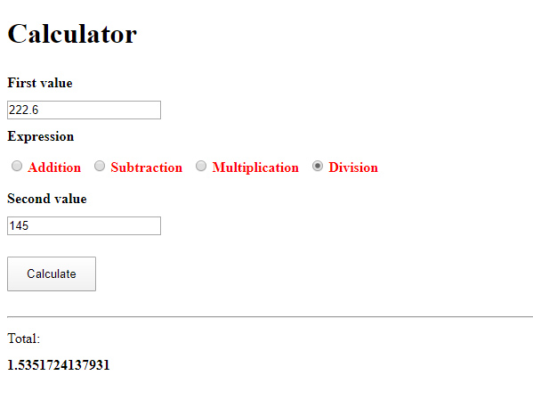
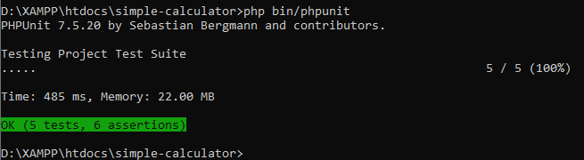

# Simple calculator using last symfony version and PHPUnit tests




## Using the Calculator Application
- The project was development using XAMPP with installed composer using last symfony version. If you have it just navigate to the chosen directory and run:
```shell
composer create-project symfony/website-skeleton simple-calculator
```
- After that install PHPUnit library:
```shell
php bin/phpunit
```
- Start development server:
```shell
php -S 127.0.0.1:8080 -t public
```

## The modifications are inside following directories:
- config/routes.yaml
- src/Controller, Entity and Form
- templates
- tests

You can clone the project into your machine and run as separate project or copy only this modifications

- After that must clear the cache:
```shell
php bin/console cache:clear --no-warmup --env=prod
```

- And run Unit Tests:
```shell
php bin/phpunit
```



On web you must navigate to <http://127.0.0.1:8080/> or <http://127.0.0.1:8080/calculator> to see the interface.
